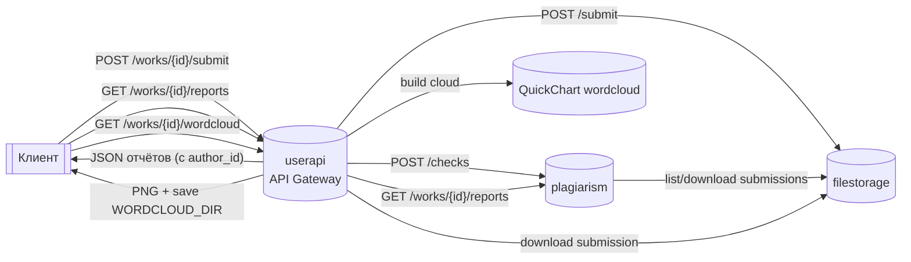

## Описание

Микросервисная система «антиплагиат»: студенты загружают работы, сервис их сохраняет, сравнивает между собой и выдаёт отчёты с совпадениями. Внешний API — только через `userapi` (gateway); хранение файлов и метаданных — в `filestorage`; анализ и отчёты — в `plagiarism`. Отдельно есть визуализация текста в виде облака слов.

## Архитектура



Микросервисы:
- `filestorage` — upload/list/download, метаданные в Postgres, файлы в MinIO.
- `plagiarism` — очередь проверок, воркер сравнивает сдачи, сохраняет отчёты (с author_id и other_author_id).
- `userapi` — REST-шлюз: submit, reports, wordcloud. Swagger UI на `/swagger`.

## Структура репозитория

- `filestorage/` — сервис хранения (cmd, api/http, usecase, infra, migrations).
- `plagiarism/` — сервис анализа (cmd, api/http, usecase, infra, воркер).
- `userapi/` — gateway (cmd, api/http, usecase, infra).
- `userapi/openapi.yaml` — OpenAPI спека публичного API.
- `docker-compose.yml` — общий запуск всех сервисов + Postgres + MinIO.
- `docs/` — вспомогательные материалы.

## Запуск

```bash
docker compose up --build
```

Поднимутся:
- filestorage: `localhost:8080`
- plagiarism: `localhost:8081`
- userapi: `localhost:8082`

Volumes: `postgres_data`, `minio_data`, `plagiarism_reports`. PNG wordcloud — в `tmp-files/wordclouds` внутри userapi (можно примонтировать).

## Быстрый тест (curl)

```bash
# отправить работу
curl -X POST http://localhost:8082/works/test-work/submit \
  -F login=test-user \
  -F file=@tmp-files/icecream.txt

# получить отчёты
curl http://localhost:8082/works/test-work/reports | jq .

# облако слов (подставь submission_id из submit)
SID=<submission_id>
curl -o wordcloud.png "http://localhost:8082/works/test-work/wordcloud?submission_id=$SID"
```

Swagger UI: `http://localhost:8082/swagger`, спека: `/openapi.yaml`.

## Конфигурация (основные env)

- `MAX_UPLOAD_SIZE_BYTES` — лимит загрузки (filestorage/userapi).
- `MATCH_THRESHOLD`, `WORKER_COUNT` — plagiarism.
- `PORT`, `FILESTORAGE_URL`, `PLAGIARISM_URL` — адреса и порты сервисов.
- `WORDCLOUD_URL` — endpoint построения облака слов (по умолчанию quickchart).
- `WORDCLOUD_DIR` — каталог для сохранения PNG (по умолчанию `tmp-files/wordclouds`).
